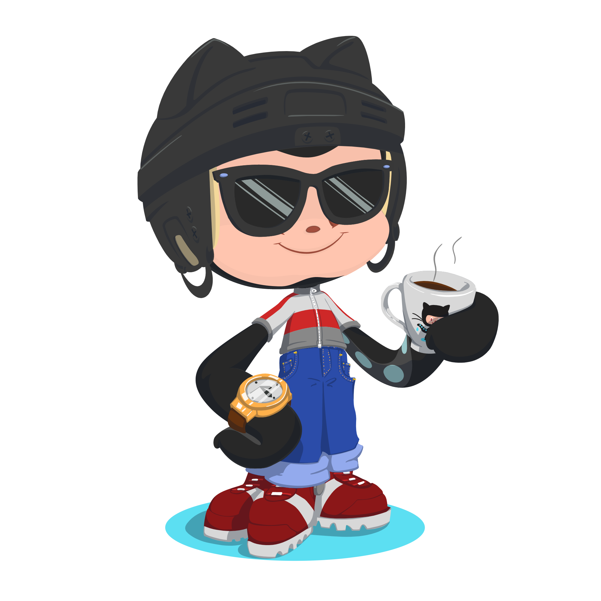

    

        
    

    

        
    

    

        
        
        
        
    

    

         
        

            <strong>
                I am a Back-End engineer with industry experience in building websites and web applications. Specialist in .NET Core Framework. Satisfactory background working with Angular, React, Blazor, and Razor Pages on multiple projects.  
                I have powerful computer science knowledge and am eager to learn more concepts and deep dive into computer science tracks. Good in Object-Oriented Programming, Data Structures, Algorithms, Database Systems, Design Patterns, and Problem Solving skills. I practiced competitive programming a lot in college and I was enjoying competing with my colleagues and mentors and participated in many programming competitions.  
                I am passionating about learning .NET, Back-End technologies, DevOps, Web 3, Blockchain, Linux, Virtualization, and Cloud Computing.  
                Detailed-oriented, responsible, committed engineer, with a get-it-done, on-time, and high-quality product spirit. Self quick learner, self-motivated, and social.
            </strong>
        

        <ul>
            <li>🔭 <b>I’m currently working on</b>: <a href="https://github.com/learning-lantern">Learning Lantern</a>.</li>
            <li>👯 <b>I’m looking to collaborate on</b>: <a href="https://github.com/AhmedFathyDev/LeetCode-Solutions">LeetCode-Solutions</a>.</li>
            <li>👯 <b>I’m looking to collaborate on</b>: <a href="https://github.com/AhmedFathyDev/HackerRank-Solutions">HackerRank-Solutions</a>.</li>
            <li>👯 <b>I’m looking to collaborate on</b>: <a href="https://github.com/AhmedFathyDev/Codeforces-Solutions">Codeforces-Solutions</a>.</li>
            <li>🌱 <b>I’m currently learning</b>: Computer Science and Software Engineering.</li>
            <li>💬 <b>Ask me about</b>: .NET.</li>
            <li>📫 <b>How to reach me</b>: Catch and follow me from the above links 👆, in addition to follow me here.</li>
            <li>🤔 <b>I’m currently open for</b>: A new job opportunity.</li>
            <li>👨‍💻 <b>All of my projects are available at</b>: <a href="https://github.com/AhmedFathyDev?tab=repositories">My GitHub</a>.</li>
            <li>👨‍💻 <b>Hire me for Back-End Development jobs</b>: <a href="https://www.upwork.com/freelancers/~0121ca7f3563e57c0b?s=1110580748673863680">Link to my UpWork Back-End Development Specialization</a>.</li>
            <li>👨‍💻 <b>Hire me for Full Stack Development jobs</b>: <a href="https://www.upwork.com/freelancers/~0121ca7f3563e57c0b?s=1110580755107926016">Link to my UpWork Full Stack Development Specialization</a>.</li>
        </ul>
    

    

        <h1>Contribution Activity</h1>
        
         
        
         
         
    

    

        
        
Loading

    

